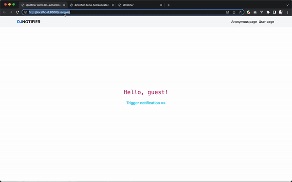

# Quick start guide
> Guide to setup `djnotifier` into your Django project

## Table of contents
- [Requirements](./QUICK_START.md#requirements)
- [Install and configure](./QUICK_START.md#install-and-configure)
- [Usage example](./QUICK_START.md#usage-example)

## Requirements
1. System requirements: **`Redis server`**
2. `pip3` packages -
    ```text
    channels
    channels-redis
    ```
   and off course `django` itself.

## Install and configure
### Step-0
```shell
pip install djnotifier
```

### Step-1
Add **djnotifier** to your `INSTALLED_APPS` setting like this

 ```python
INSTALLED_APPS = [
     ...
     'djnotifier',
 ]
 ```

### Step-2
Setup `asgi` application for the project

1. Update `asgi.py`
   ```python
   # <project>/asgi.py
   import os
   
   from django.core.asgi import get_asgi_application
   from channels.auth import AuthMiddlewareStack
   from channels.routing import ProtocolTypeRouter, URLRouter
   
   # import web-socket routes from djnotifier
   from djnotifier.routing import websocket_urlpatterns
   
   os.environ.setdefault('DJANGO_SETTINGS_MODULE', '<project_name>.settings')
   
   application = ProtocolTypeRouter({
       "http": get_asgi_application(),
       "websocket": AuthMiddlewareStack(
           URLRouter(
               websocket_urlpatterns
           )
       ),
   })
   ```
2. Configure `asgi` application in `settings` 
   ```python
   # <project>/config.py
   ...
   ASGI_APPLICATION = '<project>.asgi.application'
   ```

### Step-3
Configure `redis` layer
```python
# <project>/config.py
...

CHANNEL_LAYERS = {
   'default': {
      'BACKEND': 'channels_redis.core.RedisChannelLayer',
      'CONFIG': {
       "hosts": [('127.0.0.1', 6379)],
      },
   },
}

...
```

### Step-4
Add `djnotifier`'s `template` to a common project template e.g. `base.html or core.html`
```html
<!--templates/core.html-->

```

## Usage
### Backend
> Publish notification
```python
# send notification to an user
from djnotifier.utils import push_notification_to_user

data = {
   "type": "success",
   "message": "Congratulations! Your account is now verified"
}
push_notification_to_user(data, request.user)


# send notification to un-authenticated user(s)
from djnotifier.utils import push_notification_to_anonymous_users

data = {
   "type": "info",
   "message": "Welcome to our page!"
}
push_notification_to_anonymous_users(data)
```
### Frontend
> Show/consume push notification from frontend
```javascript
DJNotifier(style='info', text="Hi, welcome to our website!", audio=true)
```

## Demo
> Check [usage page](./USAGE_EXAMPLE.md#demo) for more information.


