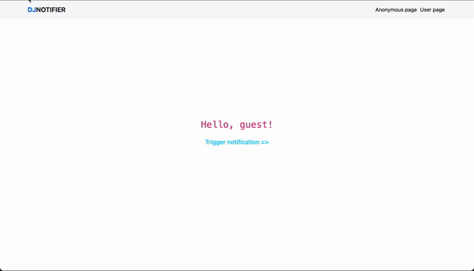
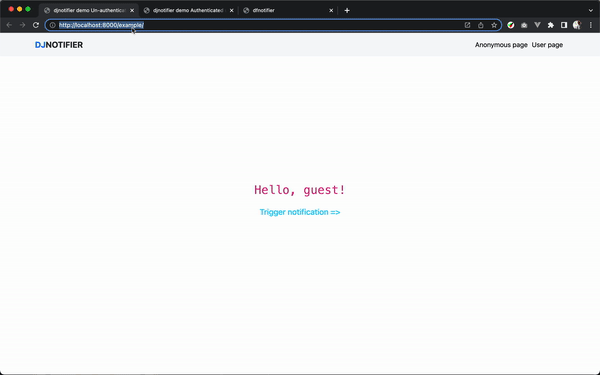

# Usage example
Example config `djnotifier`
```python
# You may replace this consumer as needed and 
# point the consumer class
DJ_NOTIFIER_CONSUMER = 'djnotifier.consumers.DJNotifierConsumer'

# If you want to register more websocket routes
# you may point to the routes list variable as - 
DJ_NOTIFIER_EXTRA_ROUTES = "<app_label>.routing.extra_routes"

# When you're developing you may want to 
# turn it on by putting `True` to see
# `djnotifier` logs
DJ_NOTIFIER_CONFIG_INFO_SHOW = False
```
Consumer class `djnotifier.consumers.DJNotifierConsumer`
```python
# djnotifier/consumers.py
import json
from channels.generic.websocket import AsyncWebsocketConsumer


class DJNotifierConsumer(AsyncWebsocketConsumer):

    async def connect(self) -> None:
        user = self.scope["user"]
        group = "dj_notifier_anonymous"
        if not user.is_anonymous:
            group = f"dj_notifier_{user.pk}"

        self.group_name = group

        await self.channel_layer.group_add(
            self.group_name,
            self.channel_name
        )
        self.groups.append(self.group_name)
        await self.accept()

    async def disconnect(self, close_code) -> None:
        await self.channel_layer.group_discard(self.group_name, self.channel_name)
        self.groups.remove(self.group_name)
        await self.close()

    async def receive(self, text_data=None, bytes_data=None) -> None:
        pass

    async def dj_notifier(self, event):
        data = event["data"]
        await self.send(text_data=json.dumps(data))
```

Copy `example` app into your Django project's root, install in your `INSTALLED_APPS`
> The `example` app comes with `djnotifier`. So, you can use it with zero config. 
```python
INSTALLED_APPS = [
     ...
     'djnotifier',
     'example',
 ]
 ```
Add example routes to `project`'s url 
```python
# <project>/urls.py
...
from django.urls import path, include
...

urlpatterns = [
    ...
    path("example/", include('example.urls')),
    ...
]
```

Now run redis-server and django development server -
```shell
# run redis-server
$  redis-server
```
in another terminal/console tab run -
```shell
# run django dev server
$ python manage.py runserver
```

Now open 2 tabs - 
1. Un-authenticated user page: http://localhost:8000/example/
2. Authenticated user page: http://localhost:8000/example/auth/

Now in another tab if you open http://localhost:8000/example/notify/
then you'll see two different notification.

# Demo
**Different notification UI**
> There are four types of notifications are available by default, they are - `info`, `warning`, `success` and `error`.


**Real time notification implementation demo**
> Demo of `djnotifier` implementation. In the demo, you can see an endpoint `/example/notify/` of `example` app sending notifications- *to all active anonymous users (in django language: un-authenticated users) in the first tab* and *in the second tab sending notification to an user with primary key i.e. `pk` 1.*


1. First case: notification to un-authenticated user(s) is triggered via a `djnotifier` method called `push_notification_to_anonymous_users` that can be imported as `from djnotifier.utils import push_notification_to_anonymous_users`
2. Second case: notification to authenticated user is triggered via a method called `push_notification_to_user` that can be imported as `from djnotifier.utils import push_notification_to_user`

**::IMPORTANT::**
> **Frontend**: `DJNotifier` method expects 3 arguments to trigger a push notification e.g. `DJNotifier(style='<notification_type>', text='<notification_text>', audio=false)`. Setting `audio=true` would play an mp3 sound.

> **Backend**: the message/notification data in `djnotifier.consumers.DJNotifierConsumer.dj_notifier` method follows a format e.g. `{"type": "success", "message": "Congrats! You're successfully registered."}`. So, while using `push_notification_to_user` or `push_notification_to_anonymous_users` method make sure to pass the data like the above example.